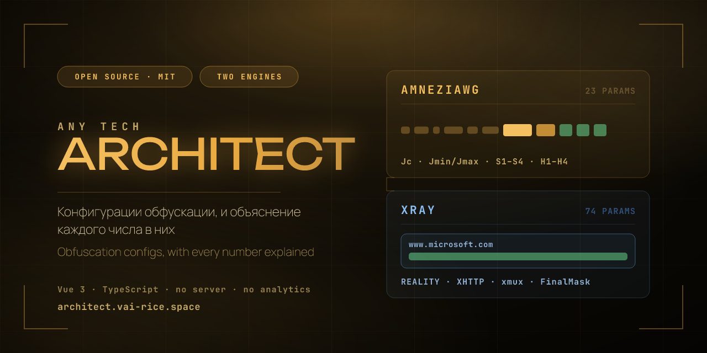
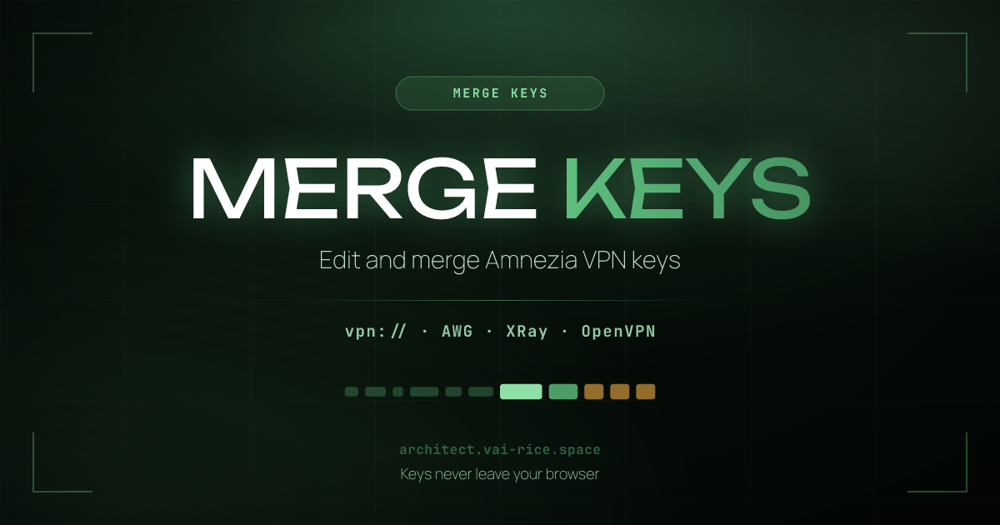
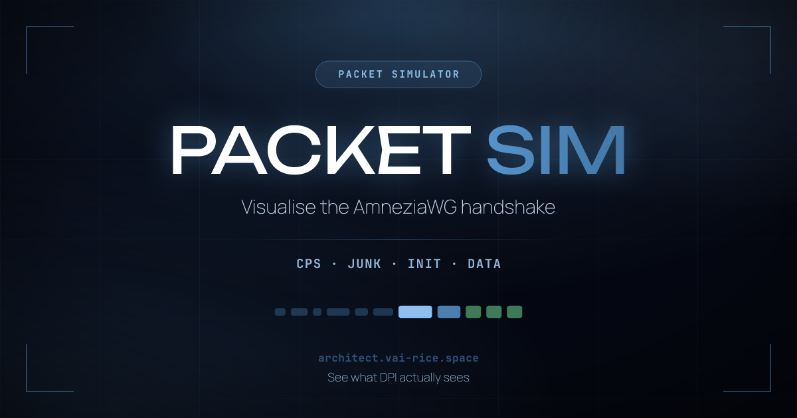
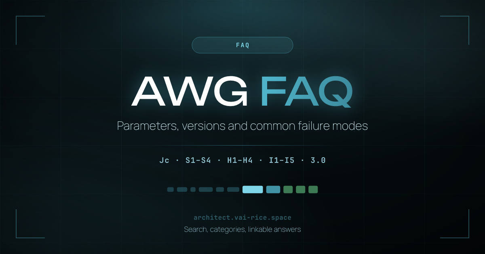
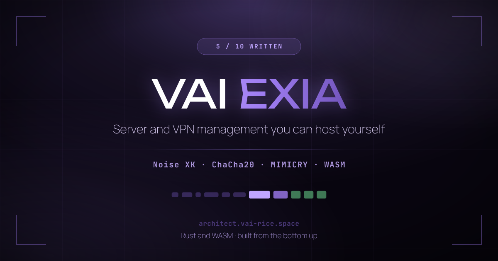
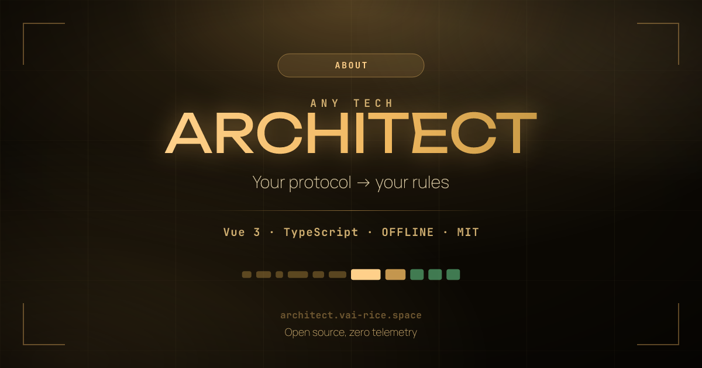

<div align="center">



[Русский](README.md) · **English**

[](https://architect.vai-rice.space/en)
[](#whats-new-in-440)
[](#amneziawg)
[](#xray)
[](LICENSE)

Obfuscation configs, with every number in them explained. Everything is computed
in your browser: neither keys nor configs are sent anywhere.

</div>

---

## What this is

The tool assembles an obfuscation configuration and explains what it is made of.
Not press-and-hope, but a working drawing: every parameter says where its bound
came from, which side reads it, and what happens when the two sides disagree.

Clients can generate these parameters themselves, and that is fine right up
until the tunnel does not come up. Then it turns out the button explained
neither what it chose nor which of it has to match on the server.

There are two engines, doing the same job from opposite directions.

| | What it does | Parameters |
|:--|:--|:--:|
| **[AmneziaWG](#amneziawg)** | Hides the traffic type: junk packets ahead of the handshake, padded messages, a substituted type byte. What shows on the wire is QUIC, TLS, SIP, STUN or DNS rather than WireGuard. | 25 |
| **[XRay](#xray)** | REALITY over VLESS. Outside is a genuine handshake with someone else's site, carrying that site's own certificate; inside is your tunnel. | 74 |

> [!IMPORTANT]
> This project exists for research and educational purposes and was never built
> for use in Russia or the CIS. Using traffic obfuscation tools may violate the
> law where you live, and responsibility for how you use it rests with you.

---

## What's new in 4.4.0

A release built out of your reports, plus one long-promised disguise.

- **STUN / TURN.** A new profile replays what WebRTC sends before a call starts:
  a Binding to a STUN server, an Allocate to a TURN relay, the same Allocate
  with credentials, and ICE connectivity checks. Tests parse every packet as
  STUN per RFC 8489: lengths, attribute alignment, FINGERPRINT.
- **I1-I5 fit the kernel module** ([#17](https://github.com/Vadim-Khristenko/Any-Tech-ARCHITECT/issues/17)).
  The module takes the whole chain in one netlink message of a page. Five SIP
  packets did not fit: the interface came up and `awg show` answered
  `Message too long`. The generator now keeps the chain within budget, and the
  config check warns about ones from elsewhere that will not fit.
- **wg-easy in the client list** ([#18](https://github.com/Vadim-Khristenko/Any-Tech-ARCHITECT/issues/18)).
  The panel accepts H1-H4 only up to 2,147,483,647, and ranges for it are now
  laid out under that cap.
- **What H1-H3 width costs** ([#14](https://github.com/Vadim-Khristenko/Any-Tech-ARCHITECT/issues/14)).
  With `RandomTrailers`, the receiver tests every transport packet against
  H1-H3 and silently drops the ones that land inside. The config check works
  out the share lost and warns, and `RandomTrailers` is now marked as a value
  both ends must share.

The full version history is on the [About page](https://architect.vai-rice.space/en/about).

---

## AmneziaWG

Plain WireGuard is too easy to recognise: a fixed message-type byte and
predictable packet sizes (148 bytes for a handshake initiation, 92 for the
response) let DPI identify the protocol from the very first packet and block it
outright.

AmneziaWG adds an obfuscation layer on top of the same cryptography. Architect
picks its parameters so they are valid, compatible with your client, and do not
accidentally recreate the very fingerprint you are trying to shed.

| | Junk `Jc/Jmin/Jmax` | `S1 S2` | `S3 S4` | CPS `I1-I5` | Headers `H1-H4` | 3.x block | 3.1 flags<br>`RandomTrailers` / `DisableCookies` |
|:--|:--:|:--:|:--:|:--:|:--:|:--:|:--:|
| **1.0** | ✅ | ✅ | — | — | fixed | — | — |
| **1.5** | ✅ | ✅ | — | client only | fixed | — | — |
| **2.0** | ✅ | ✅ | ✅ | ✅ | ranges | — | — |
| **3.0** | ✅ | ✅ | ✅ | ✅ | ranges | ✅ | — |
| **3.1** | ✅ | ✅ | ✅ | ✅ | ranges | ✅ | ✅ |

### What 3.0 and 3.1 added

These parameters were verified **against the source** of `amneziawg-go`,
`amneziawg-tools` and the kernel module, not against the docs, which describe
2.0 at the time of writing.

| Parameter | What it does |
|:--|:--|
| `HeaderProtectionKey` | A shared 32-byte ChaCha20 key. Handshake and cookie messages are encrypted whole, transport packets only in their 16-byte header. Written as base64 in a `.conf`, like `PrivateKey`, and as hex over UAPI. |
| `ContentPaddingAddition` | Random extra padding on every transport packet instead of the 16-byte alignment. |
| `RekeyAfterTime`<br>`RekeyTimeout`<br>`RejectAfterTime`<br>`KeepaliveTimeout`<br>`MaxHandshakeAttempts` | Ranges instead of WireGuard's fixed constants, so a steady handshake cadence stops being a fingerprint. |
| `RandomTrailers` <sub>3.1</sub> | A random-length trailer on every outgoing packet. **Both ends need it**: a receiver with it off expects handshakes of an exact size and drops the longer ones. |
| `DisableCookies` <sub>3.1</sub> | The device stays silent instead of sending a Cookie Reply. Breaks NAT keepalive under load, which is why the generator leaves it off by default. |

> [!WARNING]
> **With header protection on, S1-S4 cannot be below 12.** The cipher's nonce is
> never sent: it is read from the first 12 bytes of the S-padding, and a padding
> shorter than twelve bytes has none to give. Both implementations refuse such a
> configuration before the interface comes up: `amneziawg-go` returns `S%d must
> be more then %d to use headerProtection`, and the kernel module logs the same
> sentence and returns `-EINVAL`. The generator raises S to 12 by itself, and
> the check rejects configs that break it.

> [!NOTE]
> **With `RandomTrailers`, H1-H3 width costs packets.** The receiver stops
> checking handshake sizes and tests every transport packet against H1, H2 and
> H3. The bytes there are random, so the share lost is `1 − Π(1 − Wᵢ / 2³²)`,
> with `W` the width of a range. Three ranges of 300 million lose about 20% of
> the traffic, and no counter will show it. The generator keeps them under
> 50,000, and H4 is not part of the cost at all.

### Mimicry profiles

Twelve profiles, each built from the protocol's own document rather than by eye.
The tests parse the packets the way a real parser would: declared lengths are
checked against what follows them.

| Profile | Document | What shows on the wire |
|:--|:--|:--|
| QUIC Initial | RFC 9000 | The start of an HTTP/3 session, the most universal choice |
| QUIC 0-RTT | RFC 9001 | A session resumption with early data |
| HTTP/3 | RFC 9114 | A wider set of QUIC types aimed at a specific host |
| TLS 1.3 ClientHello | RFC 8446 | The opening of an HTTPS connection |
| DTLS 1.2 ClientHello | RFC 6347 | A WebRTC handshake over UDP |
| DTLS 1.3 ClientHello | RFC 9147 | The same, for stacks that have moved on |
| SIP REGISTER | RFC 3261 | A VoIP phone registering; compact form when the chain has to be short |
| **STUN / TURN** <sub>4.4</sub> | RFC 8489, 8656, 8445 | Binding, Allocate, authenticated Allocate, ICE checks |
| DNS Query | RFC 1035 | An ordinary port 53 lookup, with the name and record type in agreement |
| Noise_IK | WireGuard | WireGuard's own structure with padding, imitating nothing |
| TLS → QUIC | Alt-Svc | A switch from TLS to QUIC, the way a browser makes it |
| QUIC Burst | composite | Initial, 0-RTT and HTTP/3 back to back |

Plus a random pick. Mimicry hosts come from a shared database of **2300+
entries** with a regional filter: SIP names a host that really answers SIP,
STUN one that answers on 3478.

### Clients

**A compatibility matrix covering 14 clients.** Each has its own ceilings and
its own engine underneath, and the generator knows them: which chain tags it
parses, what maximum H and S it accepts, whether it manages the header
protection key itself.

AmneziaWG for Android, iOS and Windows (including builds before 2.0.2, with H
capped at 2³¹−1), Amnezia VPN, WG Tunnel, WireSock, mihomo / Clash.Meta, OPNsense,
Keenetic, **wg-easy**, `amneziawg-go`, the Linux kernel module, OpenWRT and ASUS
Merlin. For mihomo a proxy block in its YAML dialect comes alongside the `.conf`.

> [!TIP]
> **The kernel module and long chains.** The module takes I1-I5 in one netlink
> message of a page, about 3.4 KB for the whole chain. Any more and the interface
> comes up while `awg show` answers `Message too long`. The generator keeps the
> chain within budget for every client, since the same block usually goes onto a
> server running the module. For a pasted config from elsewhere, the check warns
> ahead of time.

The `<d>`, `<ds>` and `<dz>` tags parse in v3.0.1 but are not wired into the
send path: they are groundwork for AWG 4.0, so the generator does not emit them.

---

## XRay

REALITY solves the same problem the other way round: rather than disguising
traffic as another protocol, it borrows a whole handshake. An observer sees a
TLS session with a real donor site, carrying that site's real certificate,
because it *is* the donor's certificate, obtained from the donor.

Architect covers **74 Xray-core parameters**, laid out in sections:

| Section | What is in it |
|:--|:--|
| **REALITY** | `dest`, `serverNames`, the x25519 key pair, `shortIds`, `spiderX`, version limits and fallback caps |
| **Transport** | XHTTP in every mode, `xmux`, `sockopt`, TCP/WS/gRPC |
| **FinalMask** | Stream post-processing on top of the chosen transport |
| **VLESS** | `flow`, `encryption`, client identities |

Every parameter is marked: **generated** means chosen for you; **yours to set**
means you can, and the hint explains what to reason from; **not covered** means
said plainly, rather than left to look like an omission.

> [!NOTE]
> The donor domain and your server's address are different things, and they sit
> in different places in the interface. The donor is whose certificate you show;
> the server is where the connection actually goes. If `dest` points at one site
> while `serverNames` names another, an observer sees the mismatch from a single
> passive look, and Architect warns about exactly that.

Donors come from the same domain database: over 200 of its entries pass every
donor check, each recording what is actually known about the site rather than
an invented "status".

For hosting panels there is a separate export: their validators only know the
pre-rename vocabulary (`tcp` rather than `raw`), and the panel button renames
exactly those places. The core takes both spellings.

---

## The tools

<table>
<tr>
<td width="50%" valign="top">

<h3>MergeKeys</h3>
Edit and merge <code>vpn://</code> keys. Refresh the obfuscation on an existing
key, or collect containers from several keys into a single master key. All local.
</td>
<td width="50%" valign="top">

<h3>Packet Simulator</h3>
Shows what a session start looks like: the CPS chain, the junk train, the
handshake and data. Works for both engines and is aware of the version and the
client: 1.0 and 1.5 are drawn without what they lack, and WireSock without the
chain it never sends.
</td>
</tr>
<tr>
<td width="50%" valign="top">

<h3>FAQ</h3>
71 answers on parameters, version differences and common failure modes.
Searches both languages at once, with categories and linkable answers.
</td>
<td width="50%" valign="top">

<h3>VAIEXIA</h3>
A web panel plus Telegram, Discord and Matrix bots: run a server or a cluster
from anywhere. Coming soon.
</td>
</tr>
</table>

Both generators do **batch generation** in a Web Worker, keep a **history** that
exports to a file, and **check configs** before anything reaches a client. The
check takes configs from elsewhere too, built by other tools or by hand, which
is where problems turn up most often.

---

## How this is checked

Claiming and checking are different things, so:

- **1200+ automated tests** on every build, on Bun's built-in runner.
- Configs are generated in thousands and tested against invariants, including
  that no key material repeats between generations.
- Packets are parsed as their own protocols: QUIC per RFC 9000, TLS per 8446,
  DNS per 1035, SIP per 3261, STUN per 8489 including the CRC in FINGERPRINT.
- Limits come from the sources: the netlink message size from `amneziawg-tools`
  and the kernel module, wg-easy's H ceiling from its validator, the receiver's
  behaviour under `RandomTrailers` from `device/receive.go`.
- XRay configurations are handed to **real cores in Docker, one core per
  version**. A single core for all of them proves nothing: unknown keys are
  ignored, so a config naming a feature the core lacks passes anyway.

That last one found three mistakes the unit tests would have kept: VLESS
Encryption offered on v25.8.29, which has none; ML-DSA-65 treated as optional on
v25.7.23, which requires it; and an XHTTP mode v24.11.11 does not have.

---

## Privacy

There is no backend, so nothing exists that could receive your data. No
analytics, no trackers, no cookies, no third-party scripts; fonts are served from
the site's own domain rather than Google Fonts. All randomness comes from
`crypto.getRandomValues()` with rejection sampling to eliminate modulo bias.
`Math.random()` appears nowhere in the generators.

Save the page with <kbd>Ctrl</kbd>+<kbd>S</kbd> and it works offline.

---

## Quick start

**Online:** [architect.vai-rice.space](https://architect.vai-rice.space/en)

```bash
git clone https://github.com/Vadim-Khristenko/Any-Tech-ARCHITECT.git
cd Any-Tech-ARCHITECT
bun install
bun run dev
```

Needs Bun 1.4 or newer.

| Command | What it does |
|:--|:--|
| `bun run dev` | Dev server with HMR |
| `bun run build` | Production build: crawler stubs, `sitemap.xml`, `robots.txt` |
| `bun run build:mirror` | Build for a mirror in a hosting bucket |
| `bun run preview` | Preview the built site |
| `bun run test` | Run the tests |
| `bun run typecheck` | Type-check |
| `bun run og` | Rebuild the OG images and the GitHub preview |

### Running with nothing installed

Release archives ship `awg-serve`, a dependency-free static server written in
Rust, built for Linux, macOS and Windows:

```bash
bin/awg-serve-linux            # Linux
bin/awg-serve-macos            # macOS
bin\awg-serve-windows.exe      # Windows
```

Port defaults to 8080 (`awg-serve 3000` for another), `--no-open` skips
launching a browser. Source lives in [`tools/awg-serve`](tools/awg-serve).

The `scripts/serve.*` launchers remain as an alternative: they look for bun,
npx or python, and `--check` reports what they found without starting anything.

### Standalone generator

If a browser is not available, the same rules exist as a plain shell script,
with no dependencies and no network. It covers AmneziaWG only; XRay lives in
the browser for now:

```bash
./scripts/awg-gen.sh -v 3.1 -p quic          # one config to stdout
./scripts/awg-gen.sh -v 3.1 -n 5 -d out/     # five configs into a directory
./scripts/awg-gen.sh --help                  # every option
```

### Installing on a server

A configuration is half the job; the other half is a server that accepts it.
That is a separate project:
**[awg-containers-and-tools](https://github.com/Vadim-Khristenko/awg-containers-and-tools)**,
AmneziaWG containers for the protocol versions and an `awg-tool` utility to
deploy them.

```bash
awg-tool gen --version 3.0 --profile quic --client amneziavpn
awg-tool install --host 203.0.113.9 --user root --key ~/.ssh/id_ed25519
```

It matters most for 3.0: the official configuration pipeline cannot parse
configs of that version, so `awg-tool` bypasses the `.conf` parser and talks to
the daemon directly over its UAPI socket. Parameters are randomized per
deployment, so separate instances do not look alike to DPI.

The project is unofficial and community-maintained, same as Architect.

### If GitHub is blocked

A GitHub link inside the section about GitHub being blocked is not much help, so
here are mirrors on a self-hosted Forgejo. Feel free to share them:

| What | Mirror |
|:--|:--|
| Architect (this repository) | [git.vai-rice.space/vai_prog/Any-Tech-ARCHITECT](https://git.vai-rice.space/vai_prog/Any-Tech-ARCHITECT) |
| Server installer | [git.vai-rice.space/vai_prog/awg-containers-and-tools](https://git.vai-rice.space/vai_prog/awg-containers-and-tools) |
| Amnezia apps | [git.vai-rice.space/amnezia-vpn](https://git.vai-rice.space/amnezia-vpn) |

```bash
git clone https://git.vai-rice.space/vai_prog/Any-Tech-ARCHITECT.git
```

The first two mirror my own repositories. The third, for the Amnezia apps, is
independent and not Amnezia's official site: verify release checksums and
signatures before installing.

---

## Found a bug, or have an idea?

Please say so: it is the best way to fix what we do not know about. Open an
[issue](https://github.com/Vadim-Khristenko/Any-Tech-ARCHITECT/issues) and join
the discussion in the chat.

If the problem is a specific config, include the AmneziaWG or Xray version, the
client and its version, and the parameters themselves, **with private keys
removed**. That is almost always enough to reproduce it.

Reading the code against the upstream sources is the most useful kind of issue
there is here. All of 4.4.0 grew out of such reports: the long chains the kernel
module refused, wg-easy's H ceiling and the loss from range width were found by
users, not by the tests.

See [CONTRIBUTING.en.md](CONTRIBUTING.en.md) for how development works.

---

## Support the project

This runs on enthusiasm: no ads, no sponsors, no monetisation.

[](https://yoomoney.ru/fundraise/1GA2JV51324.260304)
[](https://patreon.com/VAI_PROG)
[](https://dalink.to/vai_prog)

<details>
<summary><b>Cryptocurrency</b>: BTC, ETH, TON, USDT, TRX, SOL</summary>

<br>

> [!CAUTION]
> Check the network before sending: funds sent on the wrong network are lost for
> good.

| Coin | Network | Address |
|:--|:--|:--|
| Bitcoin `BTC` | Bitcoin · Native SegWit | `bc1qwvfpdhjuzelw8s9vxcfjj6fatnq3cltf0d48jy` |
| Ethereum `ETH` | Ethereum · ERC-20 | `0x277195Ff068756F09683FAB523b2cdDf8Ef35B44` |
| Toncoin `TON` | The Open Network | `UQBVdcwKqy8lx_2plsf2YPbcBJdYbPtnKbddmFWZntqiAEME` |
| Tether `USDT` | JETTON · TON | `UQCaNScHxNbJsCi5Wc47rJqNpJPiDASUlMJ1nRwxq-hXSGoQ` |
| Tron `TRX` | Tron · TRC-20 | `TC8dYqkDYQkuCKe7A6PWXUgDRB8Rr2Xd9f` |
| Solana `SOL` | Solana | `4i2uWx82jhgVorPQyM2y47X2YvRgCVNNWPfNmVrGcCaE` |

</details>

---

<div align="center">



My other projects live at **[vai-rice.space](https://vai-rice.space)**

Built on ideas from [Special Junk Packet List](https://voidwaifu.github.io/Special-Junk-Packet-List/)
by [@VoidWaifu](https://github.com/VoidWaifu)

**[MIT](LICENSE)** · Made for the AmneziaVPN community

</div>
